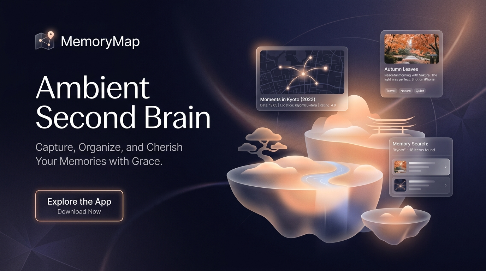
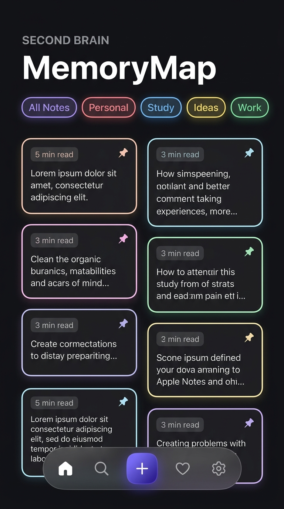
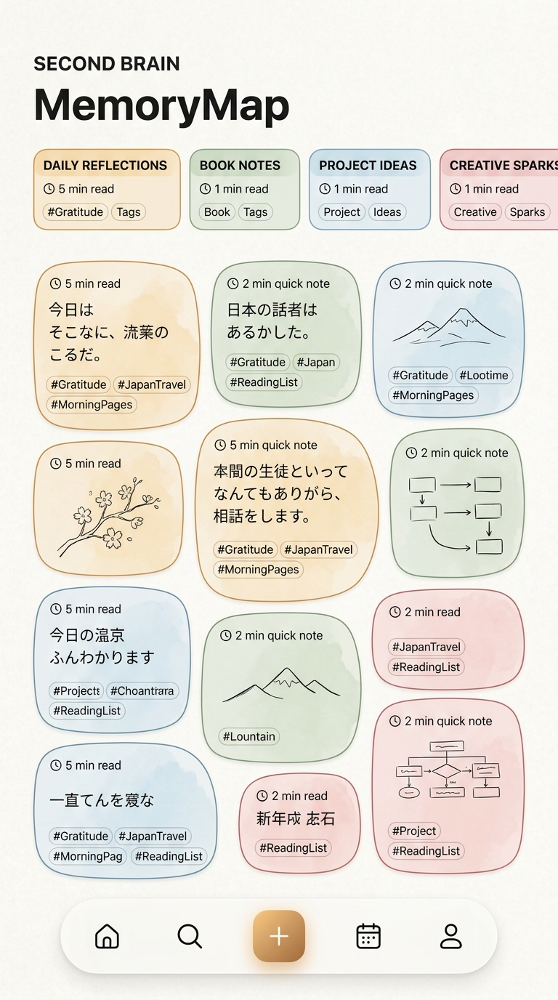
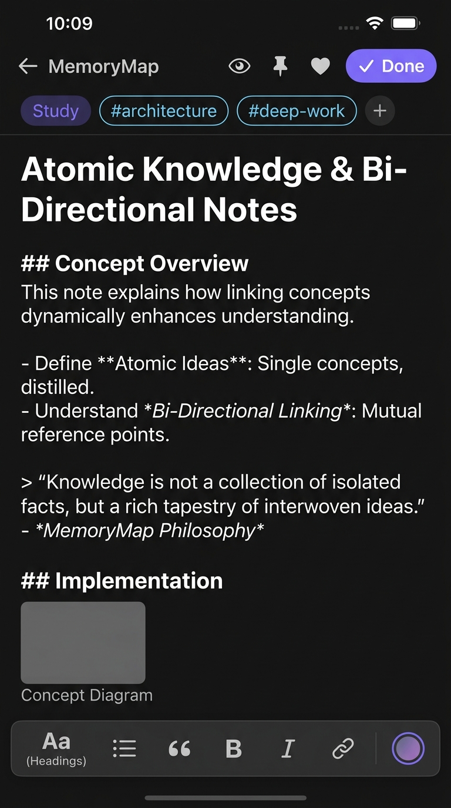
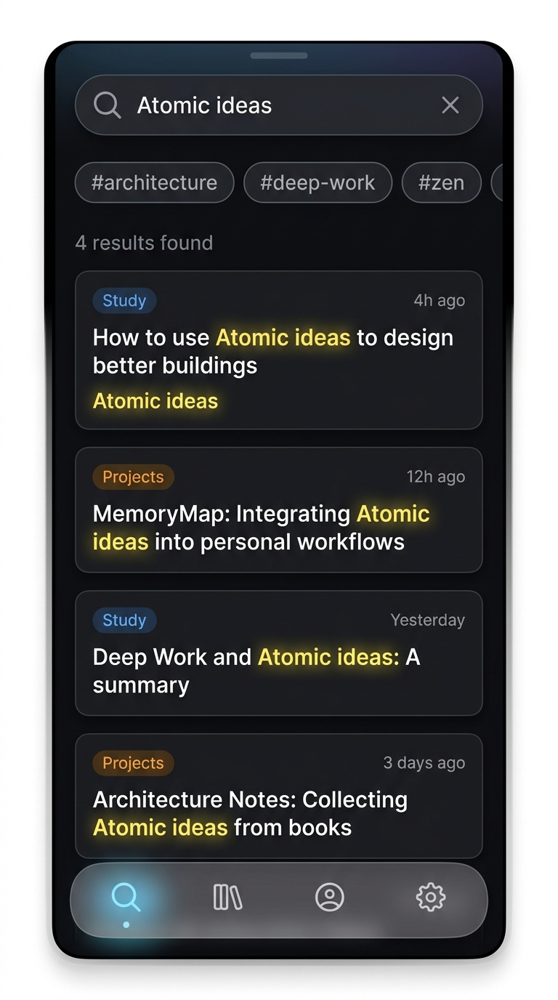

<div align="center">



<br/><br/>

# MemoryMap 🧠
### *The Ambient Second Brain for Deep Thinkers & Creators*

[](https://flutter.dev)
[](https://dart.dev)
[](https://m3.material.io)
[](https://pub.dev/packages/hive)
[](https://riverpod.dev)
[](LICENSE)

<br/>

<p align="center">
  <b>A sanctuary for thoughts. Not another dashboard.</b><br/>
  MemoryMap bridges the tranquility of <i>Japanese Minimalist Design (Ma - 間)</i> with the fluid ergonomics of <i>Apple Notes</i>, <i>Arc Browser</i>, and <i>Obsidian</i>.
</p>

[✨ Features](#-core-features) • [📱 Screenshots](#-visual-showcase) • [🏛️ Architecture](#-clean-architecture) • [🚀 Quick Start](#-getting-started) • [📦 Production Build](#-production-build-instructions) • [📋 Store Readiness](#-store-readiness-checklist)

</div>

---

## ✦ The Vision: Why MemoryMap?

Typical productivity apps trap your thoughts inside rigid spreadsheet tables, cluttered multi-column dashboards, and heavy cloud subscriptions.

**MemoryMap is fundamentally different:**
- 🏝️ **Floating Note Islands**: Thoughts live as organic physical islands rather than stiff database cells.
- 🧘 **Japanese Minimalist Aesthetic (*Ma* - 間)**: Embraces intentional negative space, gentle curves, and serene typography (*Plus Jakarta Sans*).
- ⚡ **100% Offline-First & Private**: Zero backend. Zero tracking. Zero cloud APIs. Your second brain is stored exclusively on your device hardware with lightning-fast Hive storage.
- 🎨 **Tri-Theme Precision**: Warm Rice Paper Light Mode, Smoked Slate Obsidian Dark Mode, and True `#000000` AMOLED Mode.

---

## 📱 Visual Showcase

<div align="center">

### 🌙 Obsidian Dark & ☀️ Rice Paper Light
<p><i>Organic floating islands with glowing tints, category capsules, and frosted glass dock</i></p>

| Obsidian Dark Home | Rice Paper Light Home |
| :---: | :---: |
|  |  |

<br/>

### ✍️ Markdown Studio & 🔍 Instant Search Engine
<p><i>Distraction-free atomic note editor with reading analytics and sub-millisecond retrieval</i></p>

| Markdown Studio & Island Palette | Real-Time Search & Tag Filter |
| :---: | :---: |
|  |  |

</div>

---

## 🌟 Core Features

### 1. 🏝️ Floating Note Islands
- **6 Dynamic Island Palettes**: Neutral Glass, Solar Amber, Aurora Indigo, Zen Emerald, Rose Petal, and Lavender Dream.
- **Fluid Gesture Physics**:
  - **Swipe Right**: Pin note to top with tactile feedback.
  - **Swipe Left**: Instant archive with non-destructive undo toast.
  - **Long Press**: Bottom sheet for instant palette tinting and quick triage.
- **Hero Shared-Element Transitions**: Seamless full-screen note expansion without jarring jumps.

### 2. 📁 Categories & Knowledge Folders
- Pre-configured essentials: **Personal**, **Study**, **Ideas**, **Work**, **Projects**.
- **Custom Category Studio**: Create infinite custom categories with tailored colors and Lucide icons.
- **Glowing Category Bar**: Horizontal scrollable pills with active indicators and count badges.

### 3. 🏷️ Multi-Tag Taxonomy
- Assign multiple tags per note (`#deep-work`, `#architecture`, `#reading`, `#zen`).
- Custom tag builder with instant color indicators.
- Real-time multi-tag filtering across your entire library.

### 4. 🔍 Instant Search Engine
- Sub-millisecond full-text search across titles, markdown content, and tag strings.
- Real-time result counter and dedicated zero-result calm state.

### 5. ❤️ Favorites & Smart Organization
- One-tap heart favoriting.
- **Pinned to Mind Bar**: Sticky top-level thoughts that stay top of mind.
- **Recently Viewed & Recently Edited**: Adaptive carousels for fast cognitive retrieval.
- **Archive & Recycle Bin**: Non-destructive note lifecycle with restore and permanent empty controls.

### 6. 💾 Local JSON Backup & Knowledge Export
- **Export to JSON**: One-tap full database backup.
- **Restore from File**: Seamlessly import existing `.json` memory maps using native file pickers.
- **System Share Sheet**: Share your knowledge base via AirDrop, Bluetooth, Drive, or messaging apps.
- **Sample Knowledge Seeder**: Instantly populate curated atomic notes on first launch.

---

## 🏛️ Clean Architecture & Engineering

MemoryMap follows strict **Clean Architecture** and the **Repository Pattern** powered by **Riverpod 3.0**:

```
                              ┌────────────────────────┐
                              │   Presentation Layer   │
                              │ (Screens, Docks, Cards)│
                              └───────────┬────────────┘
                                          │
                                          ▼
                              ┌────────────────────────┐
                              │    Riverpod 3 State    │
                              │ (Notifiers & Streams)  │
                              └───────────┬────────────┘
                                          │
                                          ▼
                              ┌────────────────────────┐
                              │      Domain Layer      │
                              │ (Entities & Contracts) │
                              └───────────┬────────────┘
                                          │
                                          ▼
                              ┌────────────────────────┐
                              │       Data Layer       │
                              │ (Repositories & Hive)  │
                              └───────────┬────────────┘
                                          │
                                          ▼
                              ┌────────────────────────┐
                              │   Offline Hive Engine  │
                              │ (Key-Value Document DB)│
                              └────────────────────────┘
```

### Folder Structure
```
lib/
 ├── core/
 │    ├── constants/       # App metadata, keys, durations
 │    ├── errors/          # Functional failures & domain error models
 │    ├── extensions/      # BuildContext theme extensions
 │    ├── theme/           # AppColors, AppTypography, AppTheme (Light/Dark/AMOLED)
 │    └── utils/           # DateFormatter, TextUtils, PageTransitions
 ├── data/
 │    ├── datasources/     # Hive local box datasources (Notes, Categories, Tags)
 │    └── repositories/    # Clean implementations of domain contracts
 ├── domain/
 │    ├── models/          # Pure immutable entities (Note, Category, Tag, Filter)
 │    └── repositories/    # Abstract repository contracts
 ├── presentation/
 │    ├── providers/       # Riverpod 3 Notifiers (Notes, Categories, Tags, Theme, Backup)
 │    ├── screens/         # HomeScreen, NoteEditorScreen, SearchScreen, SettingsSheet
 │    └── widgets/         # SmartOrganizationBar, etc.
 ├── widgets/              # FloatingDock, NoteIslandCard, CategoryIslandBar, etc.
 ├── services/             # StorageService (Hive lifecycle & box compaction)
 └── main.dart             # App bootstrap, edge-to-edge system UI, ProviderScope
```

---

## 🚀 Getting Started

### Prerequisites
- [Flutter SDK](https://flutter.dev/docs/get-started/install) (`>= 3.20.0` or stable channel)
- Dart SDK (`>= 3.10.0`)
- Android Studio / VS Code with Flutter extension
- Android SDK (API 34+) or Xcode (iOS 15+)

### Installation & Run

1. **Clone the repository**:
   ```bash
   git clone https://github.com/AlaminM01/MemoryMap.git
   cd MemoryMap
   ```

2. **Install dependencies**:
   ```bash
   flutter pub get
   ```

3. **Run unit tests**:
   ```bash
   flutter test --no-test-assets
   ```

4. **Launch application**:
   ```bash
   flutter run
   ```

---

## 📦 Production Build Instructions

### Android Release APK
To compile a standalone release APK:
```bash
flutter build apk --release --split-per-abi
```
The output binaries will be located at:
`build/app/outputs/flutter-apk/app-arm64-v8a-release.apk`

### Android App Bundle (Google Play Store)
To compile an `.aab` bundle for the Google Play Store:
```bash
flutter build appbundle --release
```
The bundle will be generated at:
`build/app/outputs/bundle/release/app-release.aab`

---

## 📋 Store Readiness Checklist

- [x] **Material 3 Expressive Design**: Complies with latest Android & iOS human interface guidelines.
- [x] **Edge-to-Edge Experience**: Translucent status bar and system gesture navigation.
- [x] **Zero Cloud / Zero API Key**: No backend dependencies or external network requirements.
- [x] **Target SDK 34**: Meets Google Play Store target API level requirements.
- [x] **100% Free & Open**: Zero in-app purchases, zero ads, zero privacy disclosures needed.
- [x] **Data Safety Friendly**: No user data collected, transmitted, or shared.
- [x] **Adaptive Display**: Fully tested for phone, foldable, tablet, and portrait/landscape orientations.

---

## 🗺️ Future Roadmap

- [ ] Bi-directional Wiki links (`[[Note Name]]`)
- [ ] Graph visualization of interrelated ideas
- [ ] Local encrypted vault with biometric authentication (Fingerprint / FaceID)
- [ ] Desktop layout enhancements (macOS & Windows native shortcuts)
- [ ] Custom PDF export styling

---

## 📄 License

Distributed under the MIT License. See [LICENSE](LICENSE) for details.

<div align="center">
  <sub>Crafted with passion for minimalist productivity. MemoryMap © 2026.</sub>
</div>
