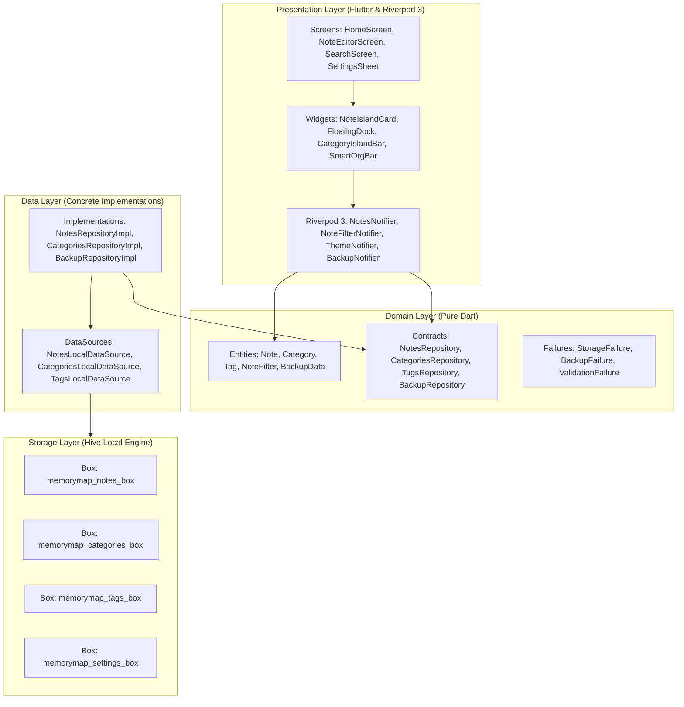
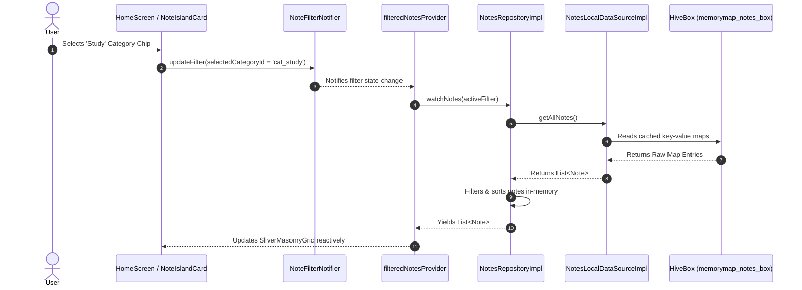
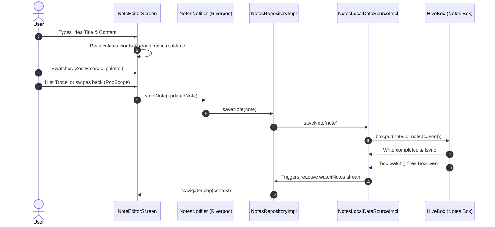
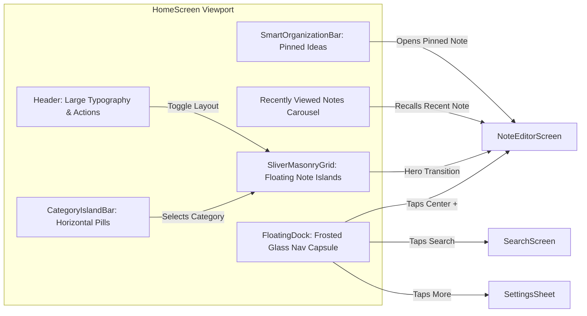
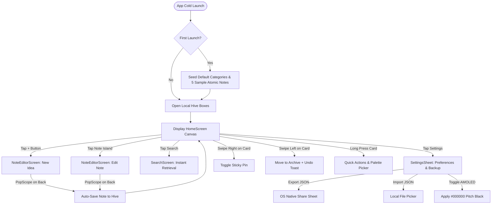
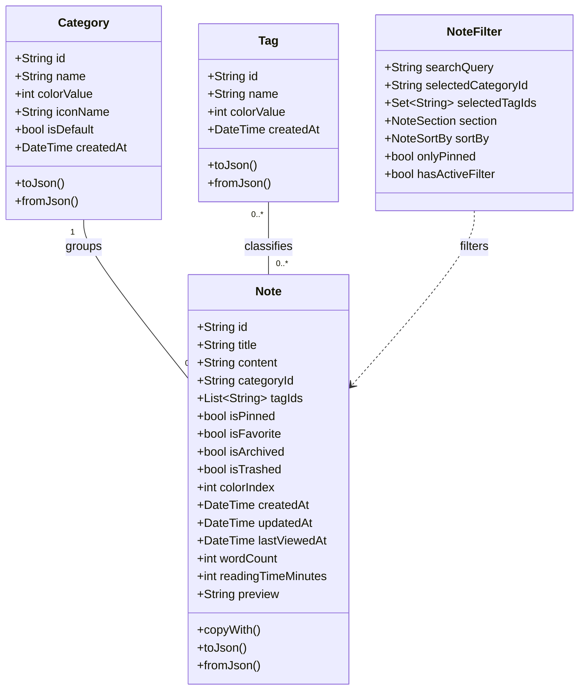

# MemoryMap 🧠 — System Architecture & Diagrams

This document illustrates the technical design, data flows, component relationships, and user journeys of MemoryMap using **Mermaid.js** diagrams.

---

## 1. Clean Architecture Layer Hierarchy

The application is structured into four decoupled layers adhering to the Dependency Inversion Principle:

---

## 2. Reactive Data Flow & Stream Pipeline

How data streams reactively from local disk to the user interface upon changes:

---

## 3. Note Creation & Persistence Lifecycle

Execution trace of writing and saving an atomic note:

---

## 4. Component Interaction Diagram

How presentation components collaborate within `HomeScreen`:

---

## 5. User Journey & Navigation State Flow

States and routes traversable by the user:

---

## 6. Offline Data Model Topology

Entity relationships inside MemoryMap's domain:

